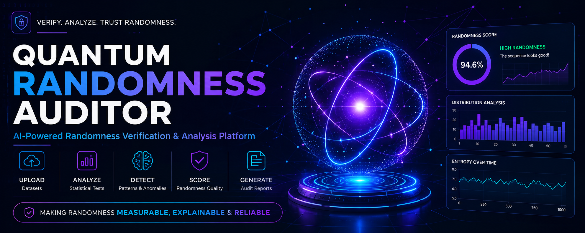

# Quantum Randomness Auditor




---

# Team Details

## Team Name

**Debug Dynasty**

## Team Members & Responsibilities

| Member | Responsibility |
|---|---|
| Agheleish | Project Planning |
| Ammetesh | Server Management |
| Anbu Pravin | UI / Frontend Development |
| Joel Raj | Database Setup & Management |
| Sajan Raj | API Planning & Development |
| Sundaram | Dataset Collection & Data Preparation |

---

# Problem Statement

Randomness plays an important role in modern systems such as:

- Cybersecurity
- Cryptography
- Online gaming
- Simulations
- Digital applications

However, random data is usually accepted without verification.

A sequence may appear random while containing:

- Hidden patterns
- Statistical bias
- Uneven distribution
- Predictable behaviour

Poor randomness can affect fairness, reliability, and security.

## Our Objective

To develop a platform that can analyze random sequences, detect anomalies, measure randomness quality, and generate an understandable audit report.

---

# Solution

## Quantum Randomness Auditor

Quantum Randomness Auditor is an AI-powered randomness verification platform that evaluates whether a given dataset behaves like a truly random process.

The system does not predict future values.

Instead, it answers:

> "How random and reliable is this sequence?"

The platform combines multiple statistical techniques to generate a randomness score and provide explainable insights.

---

# Features

## Dataset Input

- CSV dataset upload
- Manual sequence input
- Data validation
- Dataset preprocessing


## Randomness Analysis

### Entropy Analysis

Measures the uncertainty and unpredictability present in the data.

### Frequency Analysis

Checks whether values appear uniformly.

### Chi-Square Testing

Identifies deviation from expected distribution.

### Pattern Detection

Detects unusual repetitions and hidden structures.

### Distribution Analysis

Analyses numerical behaviour and balance of sequences.


## Visualization

- Interactive dashboard
- Statistical graphs
- Randomness score visualization
- Explainable audit reports


## User Experience

- Modern AI-themed interface
- 3D quantum visualization
- Simple analysis workflow

---

# Technology Stack

## Frontend

| Technology | Purpose |
|-|-|
| React.js | User Interface |
| TypeScript | Type Safety |
| Tailwind CSS | Styling |
| Three.js | 3D Visualization |
| React Three Fiber | 3D Rendering |


## Backend

| Technology | Purpose |
|-|-|
| FastAPI | API Development |
| Python | Backend Logic |
| SQLAlchemy | Database ORM |


## Data Analysis

| Technology | Purpose |
|-|-|
| NumPy | Numerical Processing |
| Pandas | Dataset Processing |
| SciPy | Statistical Analysis |


## Database

- PostgreSQL


## Development Tools

- Git
- GitHub
- VS Code

---

# System Architecture

```mermaid
flowchart TD

A[User]
-->B[React Frontend]

B
-->C[FastAPI Backend]

C
-->D[Dataset Validation]

D
-->E[Randomness Analysis Engine]

E
-->F[Entropy Analysis]

E
-->G[Statistical Tests]

E
-->H[Pattern Detection]

F
-->I[Randomness Score]

G
-->I

H
-->I

I
-->J[Dashboard Visualization]

J
-->K[Audit Report]
